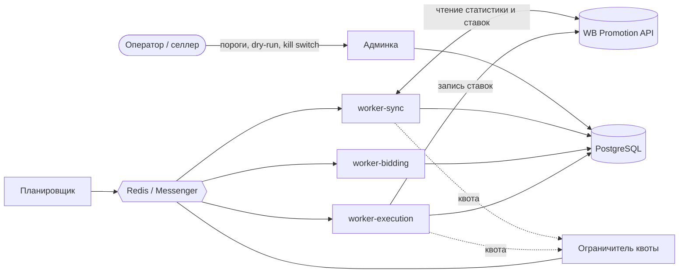
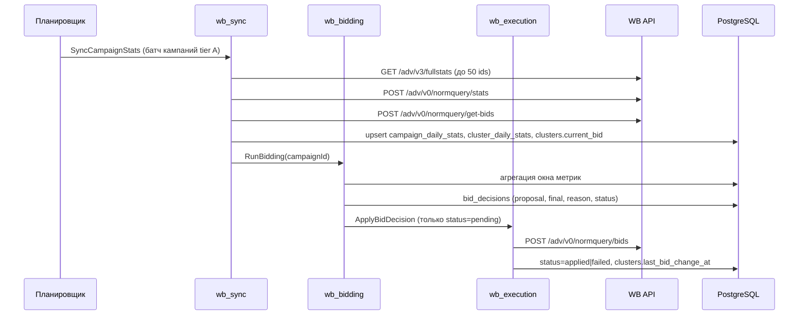
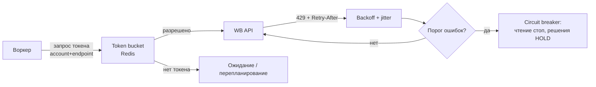
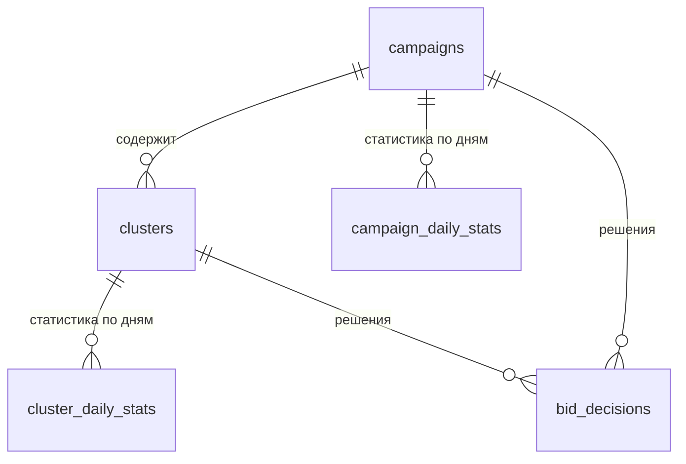
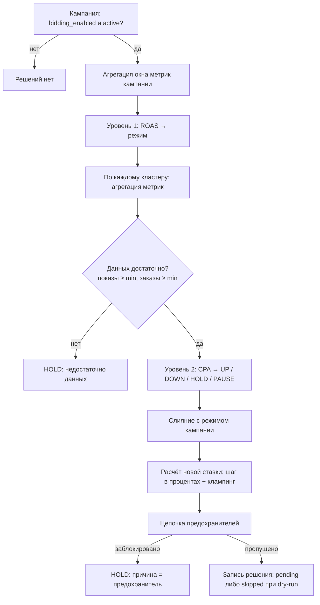

# 1. Техническое задание и архитектура биддера Wildberries

## Резюме

Биддер — это **контур управления с обратной связью**, а не оптимизатор. Он раз в N минут читает
из WB API фактическую эффективность, сравнивает её с экономическим порогом селлера, и делает
маленький шаг ставки в нужную сторону. Никакого ML: вся «интеллектуальность» вынесена в пороги,
которые селлер задаёт из своей маржинальности.

Три решения определяют весь проект:

| Решение | Почему так |
|---|---|
| **Двухуровневая стратегия**: ROAS на уровне кампании задаёт режим, CPA на уровне кластера задаёт действие | WB API не отдаёт выручку на уровне поискового кластера — ROAS там посчитать нельзя. CPA — единственная доступная экономическая метрика на управляемом уровне, но её недостаточно, чтобы не «сливать» бюджет кампании целиком |
| **Ограничитель квоты API — центральный компонент, а не middleware** | `fullstats` — 3 запроса в минуту, `normquery/stats` — 10 в минуту на аккаунт. Именно это, а не производительность БД, определяет частоту пересчёта и весь дизайн планировщика |
| **Слой предохранителей отделён от стратегии** | Стратегия отвечает на вопрос «куда двигаться», предохранители — «насколько это безопасно». Их смешение — главная причина, по которой автобиддеры разоряют селлеров: одна ошибка в формуле сразу превращается в реальные деньги |

Система обязана считать, что **её собственная стратегия может быть неверна**, и ограничивать ущерб
от этого. Отсюда: шаг ставки ограничен процентом, между изменениями обязательна пауза, есть
жёсткие границы ставки, есть суточный бюджет изменений, есть kill switch и снапшот для отката.

---

## 1. Цель и объём

### 1.1 Цель

Максимизировать **маржинальную прибыль** селлера от рекламы:

```
Profit = Σ (заказы × средний чек × маржинальность) − Σ расход на рекламу
```

Не «максимизировать ROAS» (максимальный ROAS достигается при нулевом расходе) и не
«максимизировать выручку» (максимальная выручка достигается при нулевой прибыли). Это различие —
не педантизм: оно определяет, что при высоком ROAS система **повышает** ставку, а не радуется цифре.

### 1.2 В объёме

1. Синхронизация статистики кампаний и поисковых кластеров из WB API.
2. Расчёт решения по ставке для каждого управляемого кластера.
3. Применение ставок через WB API с соблюдением лимитов.
4. Предохранители, ограничивающие ущерб от ошибочных решений.
5. Аудит: по каждому изменению ставки видно, на каких данных и по какому правилу оно принято.
6. Интерфейс оператора: настройка порогов, dry-run, история решений, аварийная остановка.

### 1.3 Вне объёма

| Не делаем | Почему |
|---|---|
| ML-оптимизация ставок (прогноз конверсии, bandits, RL) | Прямо исключено заданием. Кроме того, без объяснимости решений оператор не может отвечать за расход |
| Управление бюджетами и пополнение баланса | Отдельный контур с другими рисками (деньги на счёте, а не ставки); интегрируется как отдельный сервис |
| Создание кампаний, товарная аналитика, ценообразование | Другой домен |
| Минус-фразы, управление плейсментами | Логичное расширение фазы 3, но это отдельный цикл принятия решений |
| Оценка истинной инкрементальности рекламы | Требует holdout-экспериментов; см. [3.4](#34-известное-упрощение-атрибуция-вместо-инкрементальности) |

## 2. Термины

| Термин | Значение |
|---|---|
| `advertId` | ID рекламной кампании WB |
| `nmId` | Артикул WB (товар) |
| `norm_query` / **кластер** | Нормализованная группа поисковых запросов. Минимальная единица, на которую WB позволяет ставить ставку |
| **Ставка** | CPM — цена за 1000 показов, в копейках во внутренней модели |
| **ROAS** | `выручка / расход`. Доступен только на уровне кампании |
| **CPA** | `расход / заказы`. Доступен на уровне кластера |
| **Режим кампании** | `DEFENSIVE` / `BALANCED` / `GROWTH` — результат уровня 1, ограничивает допустимые действия уровня 2 |
| **Предложение / решение** | `proposal` — что предложила стратегия; `final` — что осталось после режима и предохранителей. Хранятся оба |
| **Окно метрик** | Число завершённых суток, по которым агрегируется статистика |
| **dry-run** | Режим, в котором система считает и записывает решения, но не выполняет ни одного изменения — ни в WB, ни в собственном состоянии |

## 3. Экономическая модель

Это раздел, который нельзя делегировать: здесь задаётся смысл всех порогов. Всё остальное —
инженерия вокруг этих формул.

### 3.1 Пороги выводятся из маржинальности, а не подбираются

Пусть `AOV` — средний чек, `m` — маржинальность вклада (после себестоимости, комиссии WB, логистики,
эквайринга и возвратов, но до рекламы).

```
Прибыль с заказа без рекламы   P     = AOV × m
Безубыточный CPA               CPA₀  = AOV × m
Безубыточный ROAS              ROAS₀ = 1 / m
```

Селлер решает, какую долю `k` маржи он готов отдавать в рекламу (`k = 0.6` означает «оставляю себе
40% маржи»):

```
Целевой CPA    CPA* = CPA₀ × k
Целевой ROAS   ROAS* = ROAS₀ / k = 1 / (m × k)
```

Пример: `AOV = 2000 ₽`, `m = 0.30`, `k = 0.6`

```
CPA₀  = 600 ₽      ROAS₀ = 3.33
CPA*  = 360 ₽      ROAS* = 5.56
```

Из этого же следуют пороги режимов кампании, а не берутся из воздуха:

| Порог | Формула | Смысл |
|---|---|---|
| `restrict_up_if_roas_below` | ≈ `ROAS₀` | Ниже безубыточности повышать ставки запрещено при любой красивой CPA кластера |
| `allow_up_if_roas_above` | ≈ `ROAS*` | Выше целевого ROAS есть запас прибыли — можно расширяться агрессивнее |
| `target_cpa` | `CPA*` | Точка равновесия для кластера |
| `pause_if_cpa_above` | `CPA₀ × 1.5…2` | Кластер уверенно убыточен, дешевле выключить, чем корректировать |

Значения по умолчанию в коде (`target_roas = 4.0`, `restrict_up_if_roas_below = 3.0`,
`target_cpa = 200 ₽`) соответствуют примерно `m ≈ 30%` и недорогому товару. **Это заготовка, а не
рекомендация**: перед боевым запуском пороги обязан пересчитать человек под конкретную нишу. Ошибка
здесь не вызовет ни падения тестов, ни алерта — она просто будет медленно съедать прибыль.

### 3.2 Почему уровней два

| | Уровень 1 — кампания | Уровень 2 — кластер |
|---|---|---|
| Метрика | ROAS | CPA |
| Источник | `GET /adv/v3/fullstats` | `POST /adv/v0/normquery/stats` |
| Есть выручка? | да | **нет** |
| Роль | ограничивает риск: задаёт режим | принимает решение по ставке |

Уровень 2 в одиночку опасен: CPA кластера может выглядеть отлично, пока кампания в целом убыточна
(дешёвые заказы дешёвого товара при дорогих возвратах, либо сдвиг микса SKU). Уровень 1 — это
экономический предохранитель на настоящей выручке.

Уровень 1 в одиночку бесполезен: ставка ставится на кластер, и ROAS кампании не говорит, **какой
именно** кластер надо править.

### 3.3 Правило слияния уровней

Асимметрично и намеренно: **режим ограничивает только рост**.

| Предложение уровня 2 | DEFENSIVE | BALANCED | GROWTH |
|---|---|---|---|
| UP | → HOLD | UP (шаг обычный) | UP (шаг увеличенный) |
| DOWN | DOWN | DOWN | DOWN |
| HOLD | HOLD | HOLD | HOLD |
| PAUSE | PAUSE | PAUSE | PAUSE |

Снижение ставки и пауза не блокируются никогда и ничем, включая режим, cooldown и деградацию
данных. Причина простая: снижение ставки — обратимое и уменьшающее расход действие, повышение —
увеличивающее расход. При равной неопределённости они не равноценны по риску.

### 3.4 Известное упрощение: атрибуция вместо инкрементальности

Система оптимизирует CPA **по атрибуции WB**. Часть атрибуированных заказов случилась бы и без
рекламы (каннибализация органики), поэтому истинная стоимость привлечения выше расчётной. Корректно
это измеряется holdout-экспериментами (отключение рекламы на части кластеров/регионов), что вне
объёма MVP. Практическое следствие, которое обязано быть в документации, а не в чьей-то голове:
**реальная безубыточность достигается при CPA ниже расчётного `CPA₀`**, поэтому `k` стоит брать
консервативнее, чем кажется по формуле.

## 4. Ограничения WB API

Полностью — в [WB-API-LIMITS.md](WB-API-LIMITS.md). Здесь только то, что напрямую формирует архитектуру:

| Ограничение | Архитектурное следствие |
|---|---|
| `fullstats` — 3 запроса/мин, до 50 кампаний в запросе, лимит **на аккаунт** | Распределённый ограничитель квоты в Redis; обязательное батчирование; расписание вместо «пересчитать всё» |
| `normquery/stats` — 10 запросов/мин | Самый дефицитный ресурс системы. Приоритизация кампаний по расходу (tiering) — не оптимизация, а необходимость |
| Установка ставок — 120 запросов/мин, батчами | Отдельная очередь записи, чтобы медленное чтение не блокировало применение решений |
| 429 при превышении | Backoff с jitter + circuit breaker + DLQ; ни одно 429 не должно молча терять решение |
| Нет выручки на уровне кластера | Двухуровневая стратегия (см. [3.2](#32-почему-уровней-два)) |
| Нет ставок на отдельные фразы | Гранулярность управления — кластер; в UI уровень «фраза» отключён |
| Ставки применяются с задержкой, статистика запаздывает | Cooldown обязателен: без него система реагирует на последствия собственных решений и раскачивает ставку |

## 5. Функциональные требования

| # | Требование | Приоритет |
|---|---|---|
| FR-1 | Регистрация кампании по `advertId` с индивидуальными порогами ROAS/CPA и границами ставок | must |
| FR-2 | Автообнаружение кластеров кампании при синхронизации | must |
| FR-3 | Синхронизация статистики кампании и кластеров за окно метрик | must |
| FR-4 | Синхронизация фактических текущих ставок из WB (источник истины — WB, не наша БД) | must |
| FR-5 | Расчёт режима кампании по ROAS | must |
| FR-6 | Расчёт предложения по ставке кластера по CPA | must |
| FR-7 | Применение предохранителей и запись решения с полной трассировкой причин | must |
| FR-8 | Применение ставок в WB с соблюдением лимитов | must |
| FR-9 | Режим dry-run без единого побочного эффекта | must |
| FR-10 | История решений с фильтрами: кампания, кластер, действие, статус, период | must |
| FR-11 | Аварийная остановка (kill switch) — глобальная и на кампанию | must |
| FR-12 | Снапшот ставок до серии изменений и откат к нему одной операцией | should |
| FR-13 | Приоритизация кампаний по расходу и расписание пересчёта | should |
| FR-14 | Автообнаружение новых кампаний аккаунта | should |
| FR-15 | Дневной график ставок (dayparting) | could |
| FR-16 | Мультиаккаунтность (несколько селлеров/токенов) | should |
| FR-17 | Бэктест стратегии на исторических данных | should |

## 6. Нефункциональные требования

| # | Требование | Значение |
|---|---|---|
| NFR-1 | Масштаб | 5 000 кампаний, ~100 000 управляемых кластеров на инсталляцию |
| NFR-2 | Полный цикл обновления горячих кампаний (tier A) | ≤ 2 часа |
| NFR-3 | Задержка от принятия решения до применения ставки | ≤ 5 минут (p95) |
| NFR-4 | Соблюдение лимитов WB | доля ответов 429 < 0,1% запросов |
| NFR-5 | Корректность границ | **ноль** случаев ставки вне `[min_bid, max_bid]` — инвариант, проверяемый автотестом |
| NFR-6 | Обратимость | любое изменение ставки откатывается по журналу за ≤ 15 минут |
| NFR-7 | Объяснимость | по каждому решению доступны: режим, предложение, финальное действие, метрики, сработавший предохранитель |
| NFR-8 | Идемпотентность | повторная доставка сообщения не приводит к повторному изменению ставки |
| NFR-9 | Безопасность | админка под аутентификацией; токены WB не в логах, не в git, зашифрованы в хранилище |
| NFR-10 | Прозрачность деградации | при недоступности API система не «замирает молча», а сигнализирует |

## 7. Архитектура

### 7.1 Контекст



### 7.2 Слои и зоны ответственности

| Слой | Пакет | Отвечает за | Не знает о |
|---|---|---|---|
| Интеграция | `src/WbApi` | HTTP, единицы измерения, версии эндпоинтов, лимиты, разбор ответов в DTO | доменных правилах |
| Синхронизация | `src/Sync` | приведение ответов API к сущностям, инкрементальный upsert статистики | HTTP, ставках |
| Метрики | `src/Metrics` | агрегация по окну, ROAS/CPA, режим кампании | HTTP, БД-запросах напрямую |
| Стратегия | `src/Bidding/Strategy`, `Merge` | «куда двигать ставку» | HTTP, БД, Doctrine |
| Предохранители | `src/Bidding/Guard` | «насколько это безопасно» | стратегии |
| Пайплайн | `src/Bidding/Pipeline` | порядок шагов, запись решения | правилах внутри шагов |
| Исполнение | `src/Service`, `src/MessageHandler` | применение решений, статусы, ошибки | стратегии |
| Интерфейс | `src/Controller`, `src/Admin` | настройка, наблюдение, аварийные действия | внутренностях стратегии |

Ключевое ограничение: **стратегия и предохранители — чистые функции над значениями**. Ни HTTP, ни
Doctrine, ни времени «из ниоткуда» (текущее время передаётся аргументом). Это то, что позволяет
покрыть их таблицами решений и property-тестами и вообще делает поведение проверяемым.

### 7.3 Поток данных



Три очереди, а не одна — потому что у этапов **разные лимиты, разные последствия отказа и разная
стоимость повтора**:

| Очередь | Лимит | Что при отказе | Повтор |
|---|---|---|---|
| `wb_sync` | 3–10 запросов/мин, самая медленная | данные устарели, решения не принимаются | безопасен, идемпотентен |
| `wb_bidding` | только CPU и БД | решения не рассчитаны | безопасен (чистый расчёт) |
| `wb_execution` | 120 запросов/мин | **ставка не применена или применена частично** | требует осторожности |

Если положить их в одну очередь, то медленное чтение статистики блокирует применение уже принятых
решений, а неудачная запись ставки застревает за 40-секундным ожиданием квоты `fullstats`.

### 7.4 Ограничитель квоты



Требования к ограничителю:

- ключ `(account_id, endpoint_group)` — лимиты WB считаются на аккаунт продавца;
- реализация распределённая (Redis), потому что воркеров несколько, а квота общая;
- лимиты берутся **из конфигурации**, не из кода: WB меняет их без предупреждения;
- ожидание токена не должно держать соединение с БД и не должно блокировать очередь записи.

### 7.5 Планировщик

Отдельный процесс (не cron внутри воркера), раз в минуту решает, какие кампании поставить в очередь:

1. выбирает кампании, у которых `next_sync_at <= now()`, отсортированные по tier и расходу;
2. группирует их в батчи по 50 (ограничение `fullstats`);
3. проверяет доступную квоту на окно и ставит столько батчей, сколько квота позволяет;
4. проставляет `next_sync_at` по tier (см. таблицу tiering в [WB-API-LIMITS.md](WB-API-LIMITS.md#23-приоритизация-кампаний-tiering)).

Почему не cron `wb:sync-stats` для всех кампаний (как в MVP): при тысячах кампаний это гарантированно
выходит за квоту, получает 429 и — при отсутствии retry-стратегии — тихо теряет задачи в DLQ.

## 8. Модель данных

### 8.1 Реализовано



| Таблица | Назначение | Ключевые ограничения |
|---|---|---|
| `campaigns` | кампания + все её пороги и границы (настройки на кампанию, а не глобальные) | `wb_advert_id` уникален |
| `clusters` | управляемый кластер, его текущая ставка и время последнего изменения | уникальность `(campaign_id, norm_query)` |
| `campaign_daily_stats` | показы, клики, заказы, расход, **выручка** по дням | уникальность `(campaign_id, date)` — делает upsert идемпотентным |
| `cluster_daily_stats` | то же без выручки (её нет в API) | уникальность `(cluster_id, date)` |
| `bid_decisions` | журнал решений: режим, предложение, финальное действие, старая и новая ставка, текстовая причина, статус | — |

Деньги: `NUMERIC(14,2)` для сумм и `int` копейки для ставок. Ни одного `float` в денежном пути.

`bid_decisions` — это не лог, а **сущность процесса**: решение сначала записывается со статусом
`pending`, и только потом отдельный воркер его применяет. Такое разделение даёт три вещи бесплатно:
аудит, возможность dry-run (решение есть, применения нет) и возможность ручного отклонения решения
до его применения.

### 8.2 Требуется дополнить (спроектировано, не реализовано)

| Таблица | Зачем |
|---|---|
| `accounts` | мультиаккаунтность: токен, лимиты, tier-настройки; токен зашифрован |
| `campaign_schedule` | `tier`, `next_sync_at`, `last_sync_at` — состояние планировщика |
| `bid_snapshots` | ставки всех кластеров кампании до серии изменений → откат одной операцией (FR-12) |
| `api_call_log` | запрос/ответ (без токена), код, длительность, потраченный токен квоты → разбор инцидентов и измерение реального лимита |
| `guard_events` | какой предохранитель сколько раз сработал → видно, что система «упирается» в границы, а не работает |
| `settings_revisions` | версии порогов кампании с автором и временем → «с какого момента ставки поехали и кто менял пороги» |
| `kill_switch` | глобальный и покампанийный стоп с причиной и автором |

Отсутствие `bid_snapshots` — самый серьёзный пробел из этого списка: без него откат неудачной серии
изменений делается руками по журналу решений.

## 9. Алгоритм принятия решения

Подробная спецификация с числовыми примерами и всеми кодами причин — в
[BIDDING_STRATEGY.md](BIDDING_STRATEGY.md). Здесь — порядок и инварианты.



Инварианты, обязательные к автоматической проверке (гейт G4 в [02-AI-WORKFLOW.md](02-AI-WORKFLOW.md)):

1. `new_bid ∈ [min_bid, max_bid]` — при любых входных данных, включая мусорные.
2. `final = HOLD` ⟹ `new_bid = old_bid`.
3. `|new_bid − old_bid| / old_bid ≤ max_change_pct` для соответствующего направления и режима.
4. `dry_run = true` ⟹ ноль записей в WB API **и** ноль изменений состояния, кроме таблицы решений.
5. Из `DEFENSIVE` не может выйти `final = UP` ни при каком предложении.
6. `PAUSE` и `DOWN` не блокируются режимом.

Инварианты 1–3 и 5–6 — это то, что должно проверяться не примерами, а перебором/property-тестами:
именно здесь ошибка стоит денег, и именно здесь пример-тест легко пройти, оставив дыру.

### 9.1 Недостаточность данных как первоклассное решение

Порядок проверок в стратегии не случаен: сначала статистическая значимость (`min_impressions`,
`min_orders`), потом экономика. Кластер с одним заказом и CPA 50 ₽ — это не «отличный кластер», это
отсутствие данных. Автобиддер, который повышает ставку на таком сигнале, систематически повышает
ставки на шуме, потому что шум чаще выглядит хорошо, чем плохо (при малых числах распределение
CPA сильно скошено).

## 10. Предохранители

Слой предохранителей — отдельная цепочка, каждый элемент может только **ослабить** действие
(превратить в `HOLD`), но никогда не усилить и не изменить направление.

| Предохранитель | Что ограничивает | Статус |
|---|---|---|
| `MinMaxBidGuard` | абсолютные границы ставки | реализован (клампинг только в гарде) |
| `DeadBandGuard` | изменение меньше `min_change_pct` | реализован |
| `CooldownGuard` | минимальный интервал между изменениями одного кластера | реализован |
| Ограничение шага | максимальный процент изменения за раз (в расчёте ставки) | реализован в `BidCalculator` |
| `DailyChangeBudgetGuard` | не более N изменений на кластер и M% кластеров кампании в сутки | **нужен** — ограничивает ущерб от системной ошибки в стратегии |
| `SpendVelocityGuard` | стоп при аномальном росте расхода за час относительно медианы | **нужен** — единственная защита от «разгона» ставок |
| `DataFreshnessGuard` | запрет `UP` на данных старше `max_data_age` | **нужен** — иначе после сбоя синхронизации система повышает ставки по устаревшей картине |
| `KillSwitchGuard` | глобальный и покампанийный стоп | **нужен** (FR-11) |
| `CampaignTypeGuard` | кластерные ставки применимы только к CPM-кампаниям с ручной ставкой | **нужен** — иначе запись обречена на ошибку API |

Порядок в цепочке — от самого дешёвого и абсолютного к контекстному: kill switch → тип кампании →
границы ставки → свежесть данных → dead band → cooldown → суточный бюджет изменений.

Мёртвая зона CPA двусторонняя: `HOLD` при `target ± cpa_buffer` (см. [BIDDING_STRATEGY.md](BIDDING_STRATEGY.md)).
Открытый блокирующий дефект процесса — только [KI-09](KNOWN-ISSUES.md#ki-09) (админка без auth).

## 11. Исполнение и идемпотентность

| Свойство | Как обеспечивается |
|---|---|
| Идемпотентность записи | В WB отправляется **абсолютное** значение ставки, а не дельта. Повторная доставка сообщения приводит к тому же состоянию. Это осознанный выбор: дельта потребовала бы точной семантики exactly-once, которой в очередях нет |
| Защита от повторного применения | Смена статуса `pending → applied` в той же транзакции; обработчик игнорирует решение не в статусе `pending` |
| Согласованность с WB | Источник истины по текущей ставке — **WB, а не наша БД**. Каждый цикл синхронизации перечитывает фактические ставки через `get-bids`. Ставка может измениться в кабинете руками |
| Частичный отказ батча | Ответ разбирается поэлементно: применённые ставки фиксируются, неудачные возвращаются в очередь. Батч не откатывается целиком, потому что WB его целиком и не откатывает |
| `last_bid_change_at` | Обновляется **только** при подтверждённом успешном изменении, иначе cooldown окажется фиктивным |
| Отказ | Статус `failed` + причина в решении; серия отказов открывает circuit breaker |

## 12. Наблюдаемость

Требования от обратного: по инциденту «за ночь расход вырос втрое» ответ должен находиться за
минуты, без доступа к прод-БД через консоль.

| Уровень | Что |
|---|---|
| Журнал решений | режим, предложение, финал, метрики на момент решения, сработавший предохранитель, старая и новая ставка — уже реализовано в `bid_decisions.reason` |
| Метрики (Prometheus) | распределение решений по действиям; число срабатываний каждого предохранителя; расход и ROAS по tier; доля 429; длина очередей; возраст данных; задержка «решение → применение» |
| Алерты | доля `UP` > 60% за час; доля `failed` > 1%; возраст данных > 26 ч; DLQ не пуст; расход за час выше медианы на X%; circuit breaker открыт |
| Аудит действий человека | изменение порогов, включение боевого режима, нажатие kill switch — с автором и временем |

Отдельно: **алерт на «система ничего не делает»**. Молчаливая остановка биддера (упавший воркер,
пустая квота, забытый dry-run) внешне неотличима от нормальной работы, и это самый частый способ
потерять деньги незаметно.

## 13. Безопасность

| Риск | Мера |
|---|---|
| Токен WB даёт право тратить деньги | Хранение в секрет-менеджере или зашифрованным в БД на аккаунт; в логи и в текст ошибок не попадает; ротация |
| Открытая админка | Обязательная аутентификация + роли: `viewer` (смотреть), `operator` (dry-run, пороги), `admin` (боевой режим, kill switch). В MVP не сделано — [KI-09](KNOWN-ISSUES.md#ki-09) |
| Массовое ошибочное изменение через UI | Подтверждение при включении боевого режима; ограничение «не более N кампаний включить за раз» |
| Утечка через фикстуры и демо-данные | Демо-`advertId` и фикстуры не должны использоваться как fallback в прод-коде — [KI-03](KNOWN-ISSUES.md#ki-03) |

## 14. Отказоустойчивость и деградация

Принцип: **при любой неопределённости деградировать в сторону меньшего расхода.**

| Сценарий | Поведение |
|---|---|
| WB API недоступен | Ставки не меняются; кампании работают с последними ставками; алерт |
| 429 | Backoff с jitter, уважение `Retry-After`, ограниченное число попыток, затем DLQ с алертом |
| Данные устарели | Запрет `UP`; `DOWN`/`PAUSE` разрешены |
| БД недоступна | Воркеры останавливаются, ничего не пишется в WB (без записи решения нет и его применения) |
| Ошибка в стратегии обнаружена в бою | Kill switch → откат к снапшоту ставок → разбор по журналу решений |
| Очередь `wb_execution` переполнена | Приоритет `DOWN`/`PAUSE` перед `UP`: сначала останавливаем трату |

## 15. Валидация стратегии

Тесты проверяют, что код делает то, что написано. Они не проверяют, что написанное **зарабатывает**.
Для второго нужны отдельные инструменты, и их отсутствие — главный технический долг MVP.

| Инструмент | Что даёт | Статус |
|---|---|---|
| Таблицы решений (unit) | каждая ветвь стратегии и каждый предохранитель на явных числах | реализовано |
| Property-тесты инвариантов | границы, шаг, отсутствие `UP` из `DEFENSIVE` — на сгенерированных входах | **нужно** |
| Контрактные тесты WB API | тело запроса и разбор ответа сверяются с зафиксированным снапшотом схемы, включая единицы измерения | **нужно** (это то, что поймало бы [KI-01](KNOWN-ISSUES.md#ki-01)) |
| Бэктест | проигрывание исторической статистики через стратегию: сколько бы изменений сделали, куда бы ушла ставка | **нужно** |
| Shadow-режим | стратегия считает решения на живых данных, ничего не применяя; сравнение с действиями оператора | **нужно** |
| Канареечный запуск | 1 кампания → 5 → 5% расхода → 100%, с автостопом по метрикам | **нужно** |

Бэктест на биддере принципиально ограничен: изменение ставки меняет саму выборку (сколько показов
получим), поэтому «прибыль по бэктесту» посчитать нельзя. Что он реально даёт — проверку
**стабильности**: частоту изменений, амплитуду, отсутствие колебаний и упирания в границы. Этого
достаточно, чтобы отсеять большинство плохих правил до контакта с деньгами.

## 16. Масштабирование

| Ось | Как масштабируется | Ограничение |
|---|---|---|
| Кампании | планировщик + tiering + батчирование | квота API на аккаунт — жёсткий потолок |
| Аккаунты | линейно: свой ограничитель и планировщик на аккаунт | нужен `accounts`, шардирование очередей по аккаунту |
| Воркеры | горизонтально | квота общая, поэтому «добавить воркеров» не ускоряет чтение статистики |
| БД | партиционирование `*_daily_stats` и `bid_decisions` по дате, retention 90–180 дней | при 100 тыс. кластеров это ~9 млн строк в месяц по кластерной статистике |

Ключевая мысль, которая часто теряется: **производительность этой системы не про CPU и не про БД**.
Она полностью определяется квотой внешнего API, и единственный способ обслуживать больше
кампаний — эффективнее расходовать запросы (батчи, кэш завершённых дней, приоритизация).

## 17. Этапы поставки

| Фаза | Содержание | Критерий готовности |
|---|---|---|
| **0. Прототип** (сделано) | Двухуровневая стратегия, 2 предохранителя, 3 очереди, mock-режим, админка, dry-run | Демо-стенд воспроизводит DEFENSIVE-блокировку `UP` |
| **1. Безопасный бой** | Ограничитель квоты, батчирование, retry/backoff, аутентификация админки, контрактные тесты единиц, kill switch, снапшот+откат | Канареечная кампания неделю без инцидентов; ноль 429 |
| **2. Масштаб** | Планировщик с tiering, автообнаружение кампаний, мультиаккаунтность, партиционирование, метрики и алерты | 5 000 кампаний, цикл tier A ≤ 2 ч |
| **3. Качество решений** | Dead band, суточный бюджет изменений, свежесть данных, бэктест, shadow-режим, dayparting | Бэктест показывает стабильность; частота изменений в норме |
| **4. Расширение** | Минус-фразы, плейсменты, рекомендованные ставки WB, holdout-эксперименты | — |

Фаза 1 сознательно не содержит ни одной новой функции для пользователя. Это цена того, чтобы
система, которая тратит чужие деньги, имела право работать без присмотра.

## 18. Открытые вопросы

| # | Вопрос | Почему важно |
|---|---|---|
| Q-1 | Единицы поля `bid` в `POST /adv/v0/normquery/bids`: рубли или копейки? Стоит ли сразу переходить на `/api/advert/v1/normquery/bids`? | Ошибка = ставка в 100 раз выше или ниже. Блокирует боевой запуск |
| Q-2 | Максимальное число элементов в `items[]` (`normquery/stats`) и `bids[]` (установка) | От этого напрямую зависит расчёт ёмкости и реалистичность NFR-2 |
| Q-3 | Точный лаг атрибуции заказов в статистике WB | Определяет корректное окно метрик и порог `max_data_age` |
| Q-4 | Маржинальность на уровне SKU — откуда берём? | Без этого `target_cpa` задаётся вручную и быстро устаревает |
| Q-5 | Поведение API при частичном отказе батча установки ставок | Определяет логику повторов и риск частичного применения |

## 19. Что реализовано в репозитории, а что остаётся проектом

| Компонент | Проект | Прототип |
|---|---|---|
| Двухуровневая стратегия ROAS + CPA | да | **да** |
| Слияние по режиму, журнал решений с трассировкой | да | **да** |
| Предохранители min/max, cooldown, ограничение шага | да | **да** |
| Три очереди, асинхронный конвейер, mock-режим, dry-run | да | **да** |
| Админка: пороги, история решений, демо-стенд | да | **да** |
| Ограничитель квоты, батчирование запросов | да | нет |
| Retry/backoff, circuit breaker | да | нет |
| Планировщик с приоритизацией | да | нет (cron по всем кампаниям) |
| Dead band, суточный бюджет, свежесть данных, kill switch | да | нет |
| Снапшот и откат ставок | да | нет |
| Аутентификация админки, мультиаккаунтность | да | нет |
| Контрактные тесты API, property-тесты, бэктест | да | нет |

Полный перечень найденных дефектов и ограничений с оценкой критичности —
[KNOWN-ISSUES.md](KNOWN-ISSUES.md). Разбор того, какие из них были внесены AI-агентом и на каком
этапе их следовало поймать — [03-AI-REVIEW.md](03-AI-REVIEW.md).
